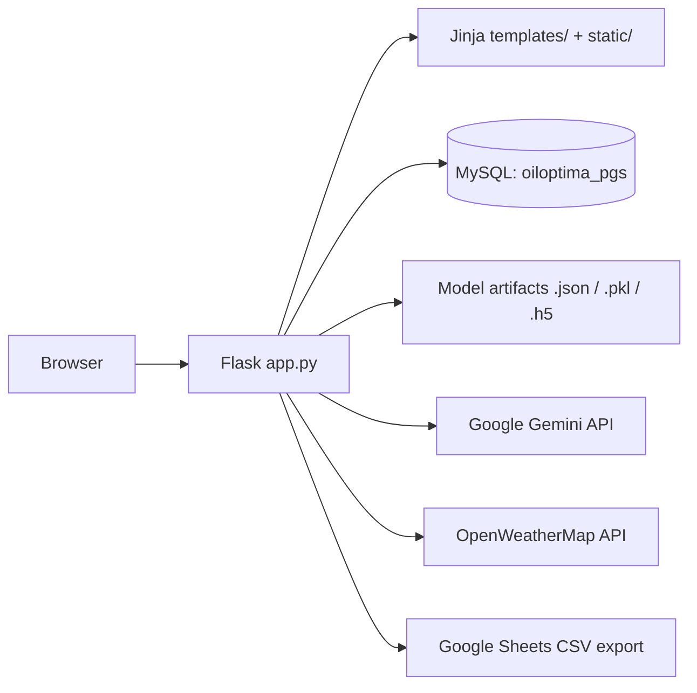

# Oil Optima

A Flask web application for a fuel and oil distribution company (PGS), combining an operations
dashboard with a set of pre-trained machine-learning models. It brings tank monitoring, demand
forecasting, fleet logistics, customer-feedback analysis and a document-grounded chatbot together
behind a single web UI.

> **Status:** academic/demonstration project. It runs on the Flask development server only and has
> no automated tests, no CI and no deployment configuration. See [Known issues](#known-issues-and-limitations).

## Capabilities

| Feature | Route(s) | Backed by |
|---|---|---|
| Login & signup, optional webcam face login | `/`, `/signup`, `/video_feed` | MySQL + OpenCV Haar cascade + MobileNetV2 embeddings |
| Tank behaviour anomaly detection | `/Tank_Behaviour_Prediction` | `tank_behavior_model.json` (XGBoost) |
| Injector failure prediction | `/Injector_failure_Prediction` | `injector_failure_model.pkl` |
| Demand forecasting / stock-out | `/Stock_out_Prediction` | `demand_forecasting.pkl` |
| Safety stock estimation | `/Safety_stock` | `modelNN_safety_stock.h5` (Keras) |
| Client feedback sentiment | `/Clients_Feedback`, `/download_excel` | Google Sheets CSV + TextBlob |
| Station CRUD & route planning | `/Logisitics`, `/add_station`, `/createpath/...` | MySQL + Dijkstra / A\* + OpenWeatherMap |
| Driver CV ranking | `/resume/<path>` | pdfplumber + CountVectorizer cosine similarity |
| Trailer / tractor forecasting | `/trailer_forecast`, `/tractor_forecast` | `terminal1_model.json`, `terminal2_model.json`, `tractor_model.json` |
| Document-grounded chatbot | `/chatbot` | Google Gemini, grounded on the PDFs in `data/brocher/` |

## Architecture

The entire application is a single Flask module, `app.py`, organised into banner-comment sections —
one per feature, each originally written by a different author. Templates are server-rendered Jinja;
there is no separate frontend build. Models are loaded from artifact files at the repository root,
some at import time and some per request.



**Import-time work.** MobileNetV2, the Keras safety-stock model, and pdfplumber text extraction over
every PDF in `data/brocher/` all run when `app.py` is imported. Startup is therefore slow, and each
edit in debug mode triggers a full reload.

**Process-global state.** `detected_face` (the webcam login buffer) and the chatbot's `messages`
history are module-level globals shared by every request and every user — not per-session.

## Technology stack

- **Backend:** Python, Flask, Jinja2
- **Database:** MySQL via `Flask-MySQLdb`
- **ML / data:** XGBoost, TensorFlow/Keras, scikit-learn, statsmodels, pandas, NumPy, matplotlib
- **Computer vision:** OpenCV (Haar cascade face detection), MobileNetV2 embeddings
- **NLP:** TextBlob (sentiment), CountVectorizer + cosine similarity (CV matching), pdfplumber
- **External APIs:** Google Gemini (`gemini-pro`), OpenWeatherMap, Google Sheets CSV export
- **Frontend:** Bootstrap-based HTML template, jQuery and vendored libraries under `static/lib/`

## Project structure

```text
Oil Optima/
├── app.py                   # The entire application (~1500 lines, 9 feature sections)
├── requirements.txt
├── .env.example             # Copy to .env and fill in
├── templates/               # Jinja templates
├── static/                  # css, js, lib, img, scss, pdfs, database
├── data/
│   ├── brocher/             # PDFs that ground the chatbot
│   ├── Faces/               # Face-image upload target (git-ignored, PII)
│   ├── pdfs/                # Driver CVs
│   └── hiring.csv, client_list.csv
├── notebooks/               # Model training / exploration notebooks
├── docs/                    # Project report, data description, demo video
├── archive/                 # Unreferenced artifacts (git-ignored, see archive/README.md)
└── *.json | *.pkl | *.h5    # Model artifacts loaded at runtime — keep at the root
```

Model artifacts are loaded by **relative path from the working directory**, so run the app from the
repository root and do not move them.

## Prerequisites

- Python 3.9–3.12
- A running MySQL server
- A webcam, only if you want the face-login path
- API keys for Google Gemini and OpenWeatherMap

## Installation

```bash
python -m venv .venv
.venv\Scripts\activate        # Windows
# source .venv/bin/activate   # macOS / Linux

pip install -r requirements.txt
```

`requirements.txt` is unpinned and includes TensorFlow and PyTorch — expect a multi-gigabyte install.

## Configuration

Copy the example file and fill it in:

```bash
cp .env.example .env
```

| Variable | Required | Default | Used for |
|---|---|---|---|
| `MYSQL_HOST` | no | `localhost` | Database connection |
| `MYSQL_USER` | no | `root` | Database connection |
| `MYSQL_PASSWORD` | no | *(empty)* | Database connection |
| `MYSQL_DB` | no | `oiloptima_pgs` | Database name |
| `FLASK_SECRET_KEY` | no | `dev-only-insecure-key` | Session cookie signing — **set a real value outside local dev** |
| `GEMINI_API_KEY` | **yes** | none | `/chatbot` |
| `OPENWEATHER_API_KEY` | **yes** | none | Weather along logistics routes |

The two API keys have no fallback: if unset, those features fail rather than sending an invalid key.

### Database

The app expects a MySQL database (default name `oiloptima_pgs`) with two tables:

- `users` — columns used in code: `username`, `password`, `email`, `join_date`, `image`
- `stations` — columns used in code: `station_id`, `station_name`, `coordination`

**No schema file exists in this repository.** The columns above were inferred from the SQL in
`app.py`; exact types, keys and constraints are unknown. Exporting a `schema.sql` from a working
database is an outstanding task for the repository owner.

## Running locally

```bash
python app.py
```

Serves on http://localhost:5000 with `debug=True`. This is the Flask development server — it is not
suitable for production use.

## Testing, linting, build

There are **no automated tests, no linter configuration, no type checking and no build step** in this
repository. Nothing was removed; none ever existed. Verification is manual, through the UI.

## Deployment

No deployment configuration exists — no Dockerfile, no CI workflow, no cloud or infrastructure
files. The application has only ever been run locally via `python app.py`. Any deployment process
would need to be designed from scratch, starting with replacing the development server with a WSGI
server and addressing the security items below.

## Troubleshooting

| Symptom | Cause |
|---|---|
| Chatbot or weather lookup errors out | `GEMINI_API_KEY` / `OPENWEATHER_API_KEY` missing from `.env` |
| `OperationalError` on login/signup | MySQL not running, wrong credentials, or the `oiloptima_pgs` database/tables do not exist |
| `TemplateNotFound: login.html` | `app.py` renders both `login.html` and `Login.html`; only `templates/Login.html` exists. Harmless on Windows, fatal on Linux/macOS — see below |
| Startup takes a long time | MobileNetV2, the Keras model and the chatbot's PDF extraction all load at import time |
| Model file not found | Run the app from the repository root; model paths are relative to the working directory |

## Known issues and limitations

**Security** — these are documented, not fixed, because fixing them changes application behaviour:

- Login queries interpolate the username directly into SQL (`app.py:163`, `app.py:197`) — **SQL injection**.
- Passwords are stored and compared in **plaintext**.
- Two API keys were previously hardcoded in `app.py` and remain in the file history on the owner's
  machine. **Both should be rotated.**
- The default `FLASK_SECRET_KEY` is a known placeholder; session cookies are forgeable unless it is set.
- `data/Faces/` stores uploaded face images (biometric PII). It is git-ignored.

**Correctness**

- `/` is registered twice — `login` (GET only) and `login_with_face` (GET/POST). GET matches the
  first rule, so the face-comparison branch is reachable only via POST.
- `app.py` renders `'login.html'` in one place and `'Login.html'` elsewhere; only the capitalised
  file exists. This works solely because Windows filesystems are case-insensitive.
- `templates/404.html`, `appointment.html`, `feature.html` and `testimonial.html` are linked from
  navbars but never rendered by any route — they are dead navigation links.
  `facelogin.html` and `index2.html` are unreferenced entirely.
- `static/scss/` ships the full Bootstrap SCSS source alongside the already-compiled CSS. It is
  build-time input only and unused at runtime.

## Attribution

The HTML/CSS user interface is derived from the "Klinik" HTML template. Its license terms are in
`templates/LICENSE.txt` and require the attribution link to be preserved — please read that file
before altering or removing template credits.
